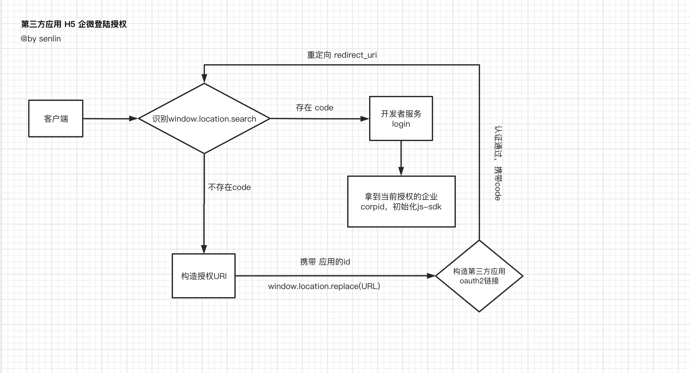

# 企业微信H5授权登录

最近在做 企微 第三方应用的 H5 登录，下面把整个流程梳理下

1. ### 构造授权链接
 * 首先 我们作为服务商的模式，需要构造第三方应用的 授权链接
 * [第三方应用链接构造](https://work.weixin.qq.com/api/doc/90001/90143/91120)，需要传 appid：第三方应用id
2. ### 拿到code授权登录 
  * 授权之后，拿到code,走我们的系统登录，这个时候，接口会根据code 告知我们 哪个企业授权的应用
3. ### 初始化 js sdk 
* 拿到解析后的 企业id ,以及我们自身应用的id 去初始化 js sdk

### 问题备注：
   这里备注下：由于 我们开发中有更换过域名，当时初始化 js  sdk的时候，一直报80001 错误，解决办法：
 第三方应用修改应用内配置，这里修改可信域名 未上线的需要删除重新安装第三方应用，已上线的需要重新提交审核上线修改的配置才会生效

流程梳理如下：




代码如下：
```
//实现一个 拦截 url search 的参数方法
const getUrlSearchParams = key => {
  const searUrlStr = window.location.search
  const paramStr = searUrlStr.split('?')[1]
  const searchParams = new URLSearchParams(paramStr)
  const val = searchParams.get(key)
   return val
}

//在页面初始化的时候，执行 getUrlSearchParams

mounted(){
  const code = getUrlSearchParams('code')
  if(code){
     //执行登录逻辑
      ......
     //执行初始化 js-sdk
     .........

 }else{
         window.location.replace(AuthUrl)
}

}
```

### 开发中出现的问题
* 登录过程需要走授权，体验不太好，所以开始了 缓存模式，把登录的信息进行 localStorage 缓存，这样进来的话，如果登录不过期 就不会重新走授权
* 问题点：切换企业，这个时候取的缓存还是前一个企业的，所以jssdk会授权失败，这里如果这个 jssdk授权失败了，并且存在缓存的情况下，我们可以尝试做重新授权
* 关于企业微信清除缓存机制：当用户重新登录的时候，会清除缓存，切换企业不会清空，pc也是一样
* 切换企业我们可以控制了，但是pc的重新登录 却不能清空，最后解决方法，在pc中打开的 ，每次走授权，这样就是当前用户的信息了。
 

