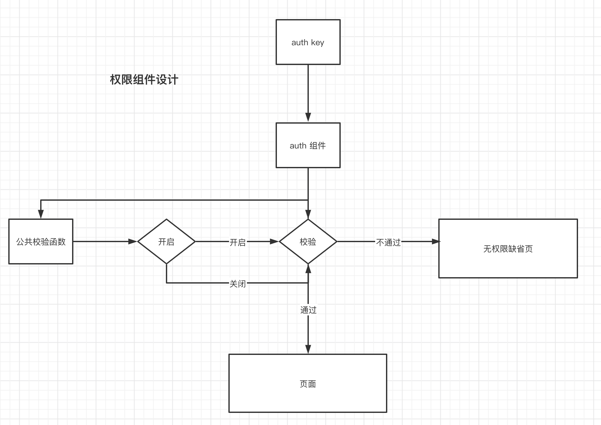

# 企业微信权限相关设计

## 问题产出
* 控制导购可以查看哪些菜单

## 如何设计
* 做成一个组件，需要控制是否显示的菜单 用组件包裹 
* 组件需要知道 当前控制菜单的权限key
* 根据key 校验是否展示
* 全局可控权限校验是否开启

## 如下图所示




## 会出现的问题：
emm，看起来很完美，但是，如果是推送或者消息点过来的页面，此时页面是第一个页面，这个时候登录，以及获取权限是异步的方式

## 解决
* 既然没获取权限，那是不是等权限加载完毕了在渲染页面不就行了吗
* 如果这样的话，那么多推送的页面都需要写个等待权限加载完毕，有没有好方法呢？
* 去实现一个 auth 拦截 page的onLoad 实现获取权限后 渲染页面
  
### 代码如下：

 ```

/**
 * 
 * @Des: 权限拦截钩子
 *  
 *  用在哪？： 打开的是第一个页面，需要登录
 *           一般是企业消息推送，聊天工具，企业话术 等过来的 并且需要校验权限点的页面
 *  如何用：包裹下 Options 并且返回Options 如：
 *  Page(auth({})) 内部会 setData AuthLoaded 告诉页面 权限，以及登录是否加载完毕 值为 true
 *  Page(auth({}),'wework-mp-api.index.coupon') 也支持传权限点的方式 
 *  内部会 setData AuthPower  true 则权限点校验通过 反之
 * 
 * AuthLoading 授权加载状态
 * AuthLoaded  是否已授权
 * AuthError   授权错误态
 * AuthPower   权限是否校验通过
 * AuthType    登录的角色权限 employee 导购端  admin  管理端
 * 
 */
import userHelp from '../helpers/user'
 

const auth = (props, authKey) => {

    const onLoad = props.onLoad
    const initReady = props.initReady

    onLoad && delete props.onLoad

    props.onLoad = async function () {
        // 推送过来的页面 既: 第一个页面 才展示 加载loading
        const pages = getCurrentPages() 
        pages.length === 1 && this.setData({AuthLoading:true})

        try{

            await userHelp.QyLogin()

            const { auth } = userHelp.GetUser()

            this.setData({ AuthLoaded: true,AuthLoading:false,AuthError:false,AuthType:auth }, () => {
                if (authKey) {
                    const AuthCheck = require('./authCheck')
                    this.setData({ AuthPower: AuthCheck.checkAuth(authKey) })
                }
                
                initReady && initReady.apply(this, arguments)
            })

            onLoad && onLoad.apply(this, arguments)


        }catch(e){

            this.setData({AuthError:true,AuthLoading:false,AuthLoaded:false,AuthType:''},()=>{
                onLoad && onLoad.apply(this, arguments)
            })

        }

      

      
    }

    return props

}

module.exports = auth

``` 

### js中 使用

```
 Page(auth({


 }))

```

### wxml中使用

```
<block wx:if="{{AuthLoaded}}">

   <Auth key="xxx">
      <your page>
   </Auth>

</block>
```
