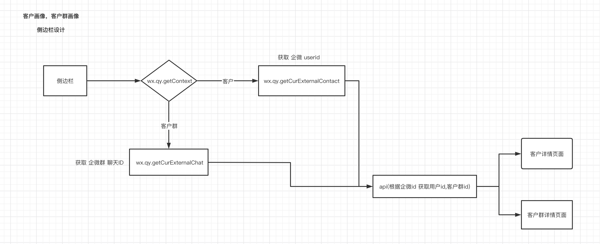
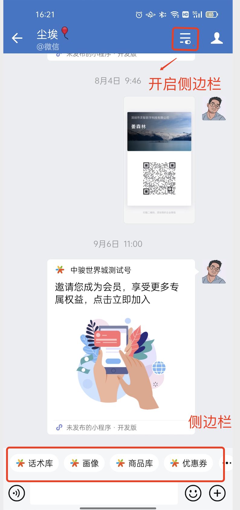
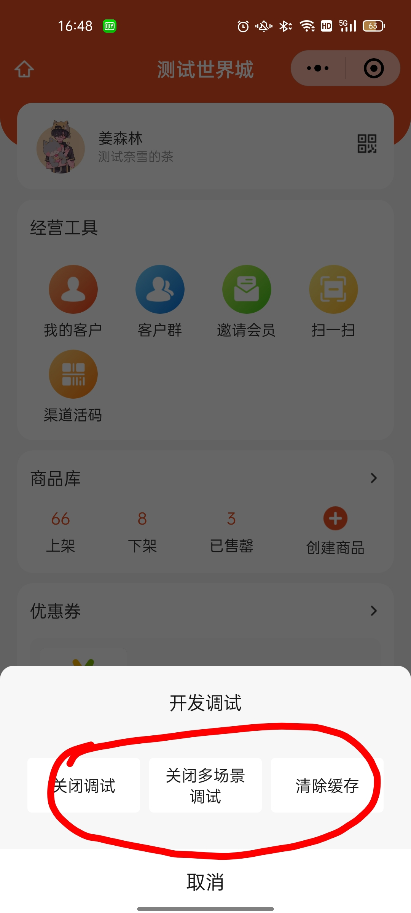

# 企业微信话术库，侧边栏相关

## 流程图：




## 获取侧边栏封装成了一个函数如下：
```
// 获取入口
export const getQyContent = ()=>{
  return new Promise((resolve,reject) => {
    wx.qy.getContext({
      success(res) {
      
        let type = ''

       const { entry } = res

       switch(entry){

        case 'contact_profile':
        case 'single_chat_tools':
        case 'chat_attachment':

        type = 'customer'

        break;

        case 'group_chat_tools' :
        
        type = 'group'

        break;
        
        default:

          type = null

       }
        
        resolve(type)

      },
      fail(e) {
     
        reject(e)
      }
    })
  })

 }

 //获取 企微 userid
export const  getQyUserId = ()=> {
  return new Promise((resolve,reject) => {
    wx.qy.getCurExternalContact({
      success(res) {
        resolve({id:res.userId,type:'customer'})
      },
      fail(e) {
        reject(e)
      }
    })
  })
 }

//  获取 企微群 聊天ID
export const getQyChartId = ()=>{
  return new Promise((resolve,reject) => {
    wx.qy.getCurExternalChat({
      success(res) {
        resolve({id:res.chatId,type:'group'})
      },
      fail(e) {
        reject(e)
      }
    })
  })
 }


 export const getWeWorkId = async()=>{

  try{

    const type = await getQyContent()

    if(type === 'customer'){
  
      return getQyUserId()
  
    }else if(type === 'group'){
  
      return getQyChartId()
  
    }else{
  
      return Promise.reject('非 正常入口')
  
    }

  }catch(e){

    throw e

  }


 }
```

## 使用

```
     const res = await getWeWorkId()

     const oj = res.type === 'customer' ? { externalUserId:res.id } : {chatId:res.id}

     const { data } = await request.Employee('seller/group/chat/get-id',oj)

    let URL = ''

    if(res.type === 'customer'){
      URL = `/pages/employee/pages/member/pages/detail/detail?customerId=${data}`
    }else if(res.type === 'group'){
      URL = `/pages/employee-group/pages/detail/detail?id=${data}`
    }else{
        
    }

    wx.reLaunch({  url:URL })

```

## 如何开启


## 如何调试
* 开启调试
* 开启多场景调试，企微打开的将是 扫码后的程序包 <br>
  <br>
