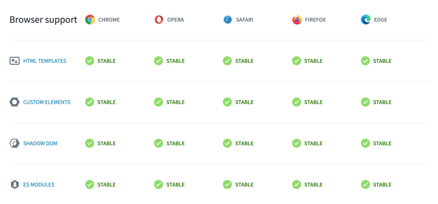
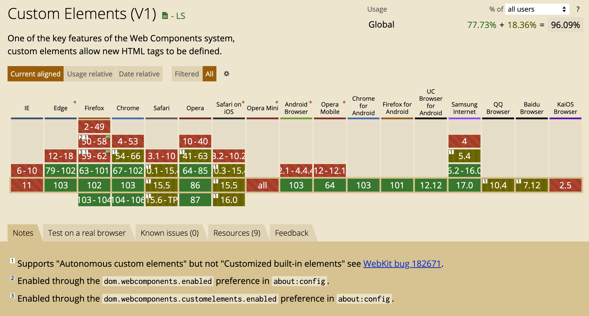
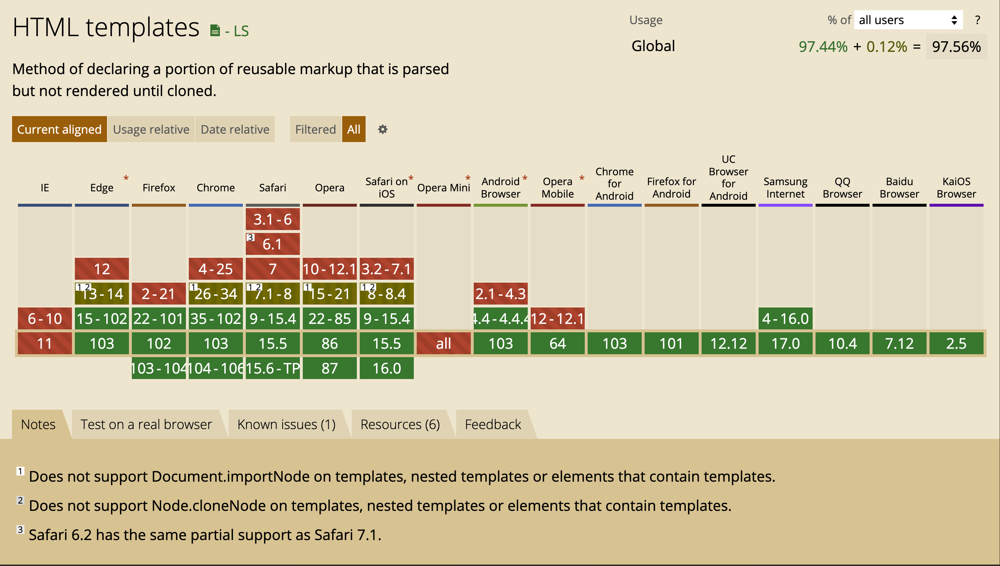
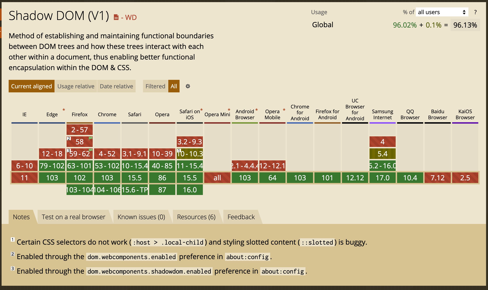
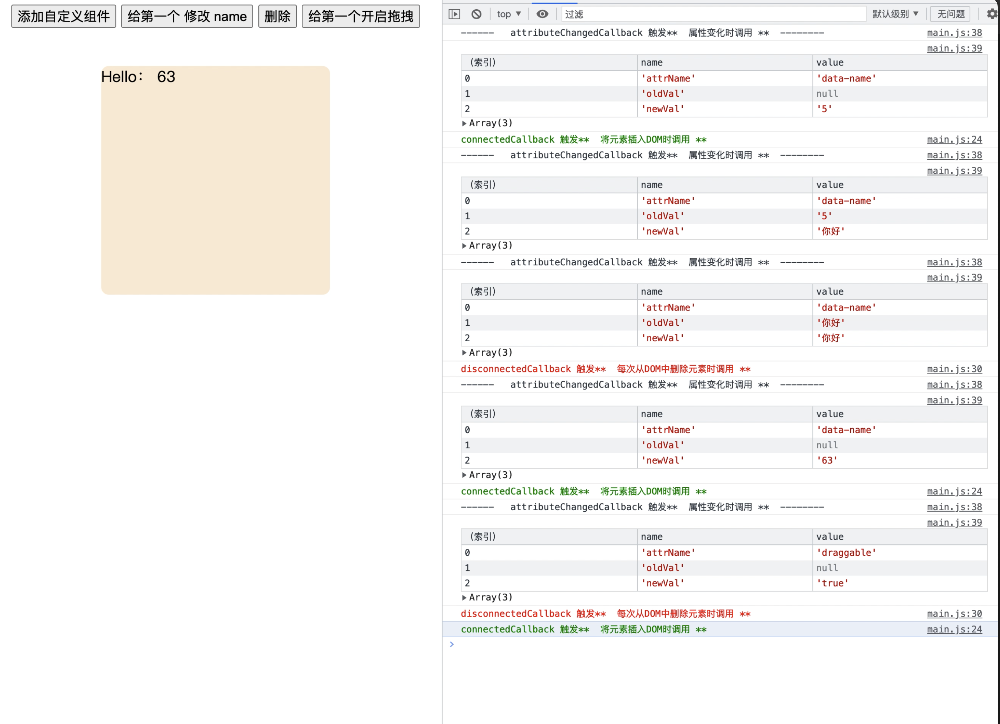
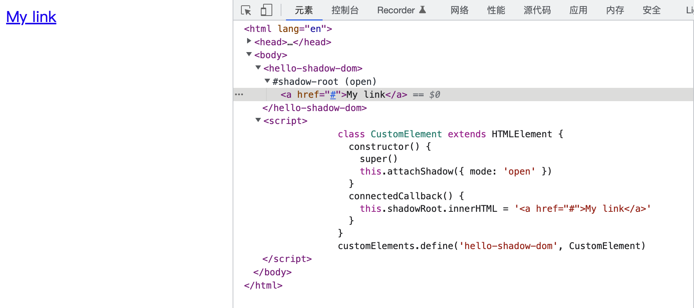
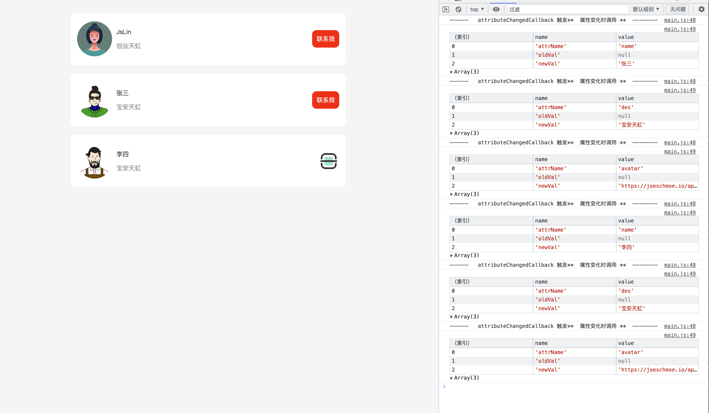

#  谈谈 Web Components 
   


# Web Components 是什么
比如我们经常使用到的，input,video 等都是标准的原生组件，现在我们可以通过这项技术构建自定义组件；  
Web Components   可以用 原生 Html 的方式 构建模块化组件;    
可以 通过自定义Html标签的形式使用，并且可以用于任何 Web 应用;  
可以和任何JavaScript库或者框架兼容（如：vue ，react等） 因为他是通过标准标签的形式构建，所以说他不依赖框架  

# 谁在用
- 国外的如： github,  YouTube, Adobe Spectrum,  
- 国内的如：[omi](https://tencent.github.io/omi/) 小程序（小程序底层组件用的是 Exparser 模仿 webComponets 实现的 ）

# Web Components 优势
  - 原生支持
  - 更好的性能优势
  - 更多优势，请参考这篇博文：https://zhuanlan.zhihu.com/p/475779606 （这篇详细的阐述了，webcomponent 的优势，大家可以下去看看）


# Web Components 兼容性
 Web Components 官网 兼容性截图
  

[数据来源](https://www.webcomponents.org/)

Can I use 更详细的兼容情况

- Custom Elements  

  

- HTML templates  

  

- Shadow  



从上面的兼容情况上看，主流浏览器基本上都支持，（ie,KaiOS(印度) 除外）
对 Custom elements 的兼容情况， Safari QQ，百度，目前还不支持自定义内置元素，比如重写 button ,input 这种 如下：

```js
class MyButton extends HTMLButtonElement{
    .... 
}
  customElements.define('my-button', MyButton, {
            extends: 'button'
    })
```
# 如何使用

## Web Components 的三大规范

- Custom elements: (自定义元素，声明，注册，导出)   
  * 自主定制元素：独立元素; 它们不会从内置HTML元素继承。
  * 自定义内置元素：这些元素继承自 - 并扩展 - 内置HTML元素
  * 用法：`customElements.define(name, constructor, options)`
    > 参数：
           name: 自定义元素名  
           constructor: 自定义元素构造器  
           options(可选) 如果有 options 则是自定义内置元素  ,如上面代码示例中 继承 input,button 等
- Shadow DOM（影子DOM）:  
  用于将封装的Shadow DOM树附加到元素上 可以将CSS样式与外部隔开，防止外部的样式影响 
- HTML templates：  
  `<template>` 和 `<slot>` 模板 和 插槽

## Custom elements
  声明和注册一个 自定义 元素如下：
 ```js
 class MyComponent extends HTMLElement {
  static get observedAttributes() {
    return [];
  }

  constructor(...args) {
    super(...args);
  }

  connectedCallback() {}

  disconnectedCallback() {}

  adoptedCallback() {}

  attributeChangedCallback(attrName, oldVal, newVal) {}
}

window.customElements.define('my-component', MyComponent)
 ```
  constructor()  
  这里的构造函数 必须声明，如果有初始化参数的话，最好传给父级
  在构造函数里，可以去注册事件的如：
  ```js
  constructor(...args) {
    super(...args);
    this.addEventListener('click', this.handleClick);
}

   handleClick(event) {}
  ```
  constructor 有的地方把它当做生命周期的一部分不，MDN 上没有把它放在生命周期上

  **生命周期函数：**   
  * connectedCallback()  
  每次将元素插入DOM时调用

  * disconnectedCallback()  
  每次从DOM中删除元素时调用

  * adoptedCallback()  
  每次将自定义元素移动到新文档时调用  
  这个生命周期，一般是 在 iframe 中 用到  
  移动节点的本质：从文档树中删除节点，但是不进行销毁，然后再插入
  

  * attributeChangedCallback()  
   当元素属性添加，删除，修改的时候调用 ,需搭配observedAttributes()使用
   注意： 这里的 监听回调 每次属性改变的时候就会触发，前提是开启数据监听，如果新值和旧值一样
   也是会触发

* observedAttributes()
如果需要在元素属性变化后，触发attributeChangedCallback()回调函数，你必须监听这个属性。  
observedAttributes()函数体内包含一个 return 语句，返回一个数组，包含了需要监听的属性名称

**Demo 展示**  


Demo演示[生命周期测试](./demo/1-custom-life-cycle/index.html)

## Shadow DOM
Shadow DOM 允许 自定义组件 和页面上其他代码进行隔离（html，css）

**使用**  

创建 shadow Dom 的方式只有通过 attachShadow() 这个方法;  

```js
<script>
 class CustomElement extends HTMLElement {
   constructor() {
     super()
     this.attachShadow({ mode: 'open' })
   }
   connectedCallback() {
     this.shadowRoot.innerHTML = '<a href="#">My link</a>'
   }
 }
 customElements.define('hello-shadow-dom', CustomElement)
</script>
<hello-shadow-dom></hello-shadow-dom>
```

**参数含义:**  
      open： shadow root 元素可以从 js 外部访问根节点  
      closed：拒绝从 js 外部访问 shadow root 节点
      这个其实相当于，是否暴露给外部能够访问组件  
      
      先看下 Demo:[案例代码](./demo/2-shadowDom/index.html)


**demo 展示**  


[案例代码](./demo/2-shadowDom/index.html)

##  `<template>` 和 `<slot>`   
template 模板
slot 是一个原生的标签，本身不会被渲染到页面上，但是内容会

**模板和插槽的使用**
在 html 中 创建模板
```html
<template id="my-template">
 <div>
   <h2>身份信息</h2>
   <slot name="person-name">姓名</slot>
   <ul>
     <li><slot name="person-age">年龄</slot></li>
     <li><slot name="person-occupation">职业</slot></li>
   </ul>
 </div>
</template>
```

在js中创建模板
```js
// 直接通过 模板标签的形式 创建模板，然后插入 文档内容
const template = document.createElement('template')
template.innerHTML = `<div class="wrapper">test</div>`
// 通过 createElement 的方式 插入样式
 const style = document.createElement('style')
 style.textContent = `
          .wrapper {
            color: red;
          }`

// 通过 adoptedStyleSheet 的方式 添加样式
const style2 = new CSSStyleSheet()
style2.replaceSync(`.wrapper {font-weight:bold;}`)

class TestComponents extends HTMLElement {
 constructor() {
   super()
   const shadowRoot = this.attachShadow({ mode: "close" })
   shadowRoot.appendChild(style)
   shadowRoot.adoptedStyleSheets = [style2]
   shadowRoot.appendChild(template.content.cloneNode(true))
 }
}
customElements.define('test-components', TestComponents)
```
`注意： 这里的 adoptedStyleSheet与style标签混合使用都会生效，互相影响`  

**Demo演示**  
  

[案例代码](./demo/3-template/index.html)


## 事件传递

`new CustomEvent(eventName, params)`  
[MDN 详细说明](https://developer.mozilla.org/zh-CN/docs/Web/API/CustomEvent/CustomEvent)  

new 

通过 CustomEvent 去定义一个 自定义事件, params 的传值，必须挂载到 detail  上如：
```js
 new CustomEvent('statusChange',{
   detail:{status:false}},
   bubbles: false,  //是否开启冒泡
   cancelable:true,  // 事件是否可以取消
   )
```

**事件分发**
`window.dispatchEvent(event)`
```js
window.dispatchEvent( new CustomEvent('statusChange',{detail:{status:false}}))
```


## Web Components 工具库
- [Stencil](https://stenciljs.com/) 支持用Ts Jsx 的方式构建Web Components
- [使用vue 构建自定义 web Components 元素](https://v3.cn.vuejs.org/guide/web-components.html#%E4%BD%BF%E7%94%A8-vue-%E6%9E%84%E5%BB%BA%E8%87%AA%E5%AE%9A%E4%B9%89%E5%85%83%E7%B4%A0)
- [tencent omi](http://omijs.org/)


# 参考来源
- [www.webcomponent](https://www.webcomponents.org/introduction) 
- [Web components: the secret ingredient helping power the web](https://web.dev/web-components-io-2019/)
- [MDN](https://developer.mozilla.org/zh-CN/docs/Web/Web_Components/Using_custom_elements)


# 思考题🤔

通过上面的介绍，以及Demo 的演示，问大家一个问题：  
  Web Components 如果跨组件通信呢？
  比如 父子，爷孙 如何通信呢？